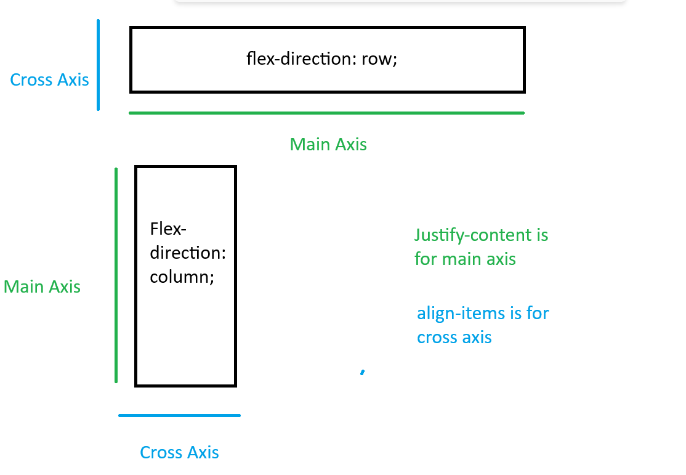

# Flex Box

    display: flex;

With grid we set the width of the columns first, but w/ flex boxes they will only be as large as they need to be, they flex.

[video Explanation](https://www.youtube.com/watch?v=phWxA89Dy94&ab_channel=SlayingTheDragon)
A div container can have a display property of flex.

The now, flex container, has control over how its immediate children are laid out

**By default the flex-direction is row**

- When the flex-direction is row the cross axis runs veritcally and the main axis runs horizontally
- When the flex-direction is column the cross axis runs horizontally and the main axis runs vetically
- Justify-content is for the main axis
- Align-items is for the cross axis
- changing item-width will change how much space the items take up

*This is the flex box equivilent to 1fr in grid. Dictates the proportion of remainig space to take up.*

**max-width** will allow a flex area to grow only to that width.

- justify-content can have **space-between** (makes equal space between elements), start (starting on the right), end(starting on the left), center (in the center)
- align-items can have end, start, center, stretch (will fill up entire space)
