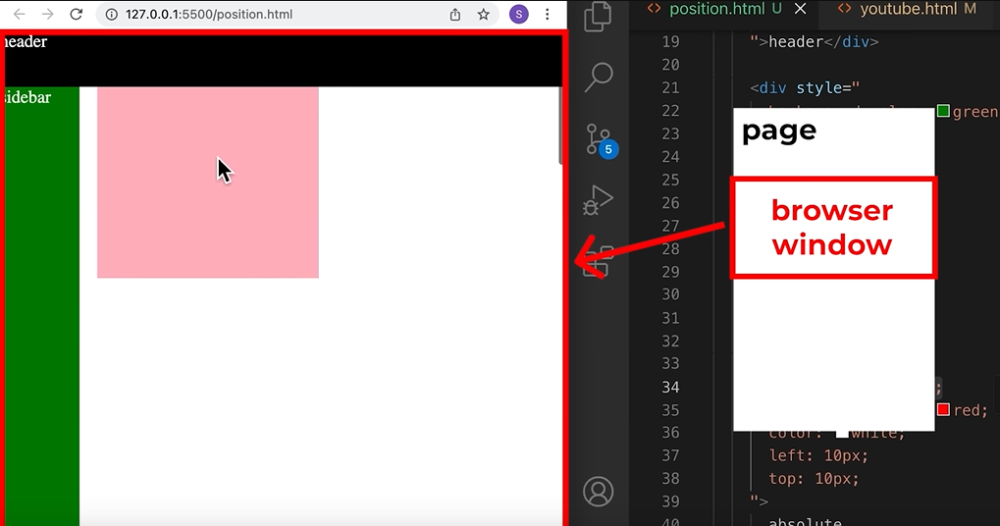

# CSS Position

- top: will set how close it is to the top of the page
- left: how far it is from the left of the page
- right: how far from the right of the page
- bottom: how far it is from the bottom of the page

## terms

- A positioned element is an element whose computed position value is either relative, absolute, fixed, or sticky. (In other words, it's anything except static.)
- A relatively positioned element is an element whose computed position value is relative. The top and bottom properties specify the vertical offset from its normal position; the left and right properties specify the horizontal offset.
- An absolutely positioned element is an element whose computed position value is absolute or fixed. The top, right, bottom, and left properties specify offsets from the edges of the element's containing block. (The containing block is the ancestor relative to which the element is positioned.) If the element has margins, they are added to the offset. The element establishes a new block formatting context (BFC) for its contents.
- A stickily positioned element is an element whose computed position value is sticky. It's treated as relatively positioned until its containing block crosses a specified threshold (such as setting top to value other than auto) within its flow root (or the container it scrolls within), at which point it is treated as "stuck" until meeting the opposite edge of its containing block.

## position is a css property that can have the values of:

- static: The element is positioned according to the normal flow of the document. The top, right, bottom, left, and z-index properties have **no effect**. This is the default value.

- fixed: The element is removed from the normal document flow, and no space is created for the element in the page layout. The element is positioned relative to its initial containing block, which is the viewport in the case of visual media. Its final position is determined by the values of top, right, bottom, and left. *It will scroll with the page and always stay in the browser window! ALSO: To make the elements below the nav bar, that would be using the fixed property, add **padding** to the top of the body so that they aren't under the nav bar when the user is scrolled all the way up.* This value always creates a new stacking context. In printed documents, the element is placed in the same position on every page.

- absolute: The element is removed from the normal document flow, and no space is created for the element in the page layout. The element is positioned relative to its closest positioned ancestor (if any) or to the initial containing block. Its final position is determined by the values of top, right, bottom, and left.

- relative: The element is positioned according to the normal flow of the document, and then offset relative to itself based on the values of top, right, bottom, and left. The offset does not affect the position of any other elements; thus, the space given for the element in the page layout is the same as if position were static.

- sticky: The element is positioned according to the normal flow of the document, and then offset relative to its nearest scrolling ancestor and containing block (nearest block-level ancestor), including table-related elements, based on the values of top, right, bottom, and left. The offset does not affect the position of any other elements.This value always creates a new stacking context. Note that a sticky element "sticks" to its nearest ancestor that has a "scrolling mechanism" (created when overflow is hidden, scroll, auto, or overlay), even if that ancestor isn't the nearest actually scrolling ancestor.

**SEE VIDEO IN RESOURCES FOLDER OF THESE IN ACTION.**
https://developer.mozilla.org/en-US/docs/Web/CSS/position

## layering
CSS elements that are below, in the CSS file, another element, will generally appear above that element on the web page.

**z-index** will override the default layering property and force them to a specific layer.

## Identifying the containing block

The process for identifying the containing block depends entirely on the value of the element's position property:

1. If the position property is static, relative, or sticky, the containing block is formed by the edge of the content box of the nearest ancestor element that is either a block container (such as an inline-block, block, or list-item element) or establishes a formatting context (such as a table container, flex container, grid container, or the block container itself).
2. If the position property is absolute, the containing block is formed by the edge of the padding box of the nearest ancestor element that has a position value other than static (fixed, absolute, relative, or sticky).
3. If the position property is fixed, the containing block is established by the viewport (in the case of continuous media) or the page area (in the case of paged media).
4. If the position property is absolute or fixed, the containing block may also be formed by the edge of the padding box of the nearest ancestor element that has the following:
    - A transform or perspective value other than none
    - A will-change value of transform or perspective
    - A filter value other than none or a will-change value of filter (only works on Firefox)
    - A contain value of layout, paint, strict or content (e.g. contain: paint;)
    - A container-type value other than normal
    - A backdrop-filter other than none (e.g. backdrop-filter: blur(10px);)
