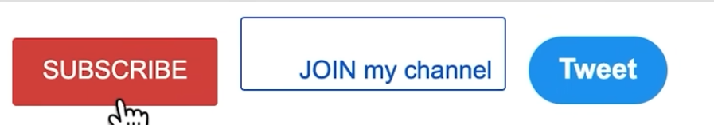

# Alignment

By default the browser will align items based on their text:

**vertical-align: top** will align the elements based on the top of their border as opposed to where the text is inside them:

