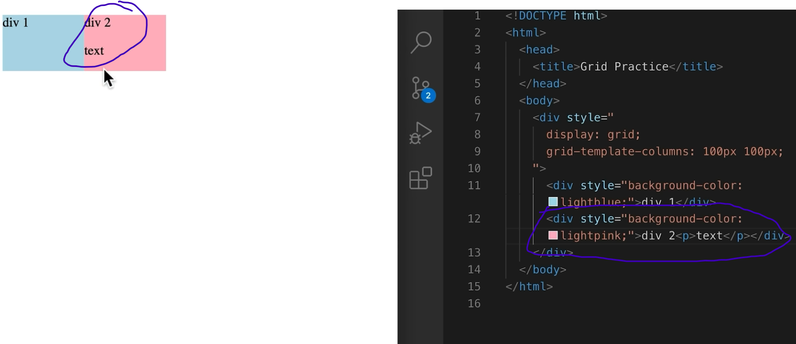
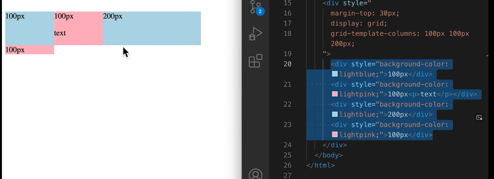

# CSS Grid

use by:

    display: grid;
    grid-template-column: 100px 100px; (means a grid with two columns each w/ a width of 100 px)

grids will maintain alignment much better than using an in-line block.

for example: 

*Here the second column of the grid has a second p element added to it and it buts it below the first text presrving the width of the column and growing its height.*

*Here there were only 3 column sizes specified but 4 divs in the div that was given the grid display property. Thus a second row was created and the 4th div was wrapped around and put in the 1st column, 2nd row.*

    grid-template-columns: 100px 1fr; (1fr means will take up the remaining space on the line).

the coefficient in front of the fr means how much of that space the fr will get.
For ex: if you have grid-template-columns: 1fr 1fr; both columns will take up the same amount of space and both of them together will take up all the space. 2fr 1fr means the 1st column will be twice as wide as the first. 

    column-gap: 20px;
    row-gap: 20px;

This will add gaps between the rows and columns.

## Making grid adjust number of columns due to screen size
    grid-template-columns: repeat(auto-fill, minmax(200px, 1fr));

*This sets up a basic grid where each item takes up at least 200px if there's space. The grid will try to fit as many columns as it can, depending on the viewport width.*

The grid-template-columns property of CSS Grid, combined with the repeat() function and auto-fill or auto-fit keywords, allows the grid to adapt to different container widths.