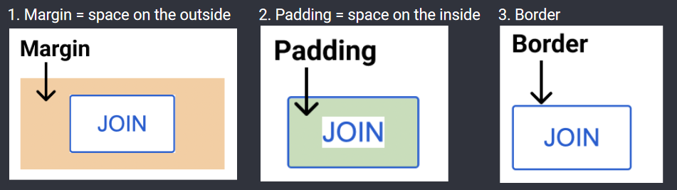

# The Box Model

Determines how much space and how far away from other elements something is.
Using this is better than forcing height and width as the element will grow with its content.

1. **Margin:** The space on the outside of an element
2. **Padding:** The space on the inside of an element
3. **Border:** The width of the border of the element

## For adjusting:
### Margin:
- margin-right (or left, top, bottom)
- margin: using 1 argument will put that on all sides, using 2 will put the first argument for the top and bottom and the second argument for the left and right
- **Negative** margin pulls things towards an element, whereas positive margin adds space between them

### Padding:
- padding-right (or left, top, bottom)
- padding: using 1 argument will put that on all sides, using 2 will put the first argument for the top and bottom and the second argument for the left and right
- **Negative** padding does nothing

### Border:
- border-width: sets width
- border-style \<top\> \<right\> \<bottom\> \<left\>: sets the type of border ie none, dotted, inset, solid, dashed, groove... (same logic for number of arguments)
- border-color: sets color of border
- **border: \<width\> \<style\> \<color\>;** is shorthand for all three